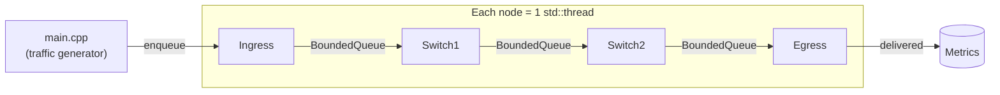
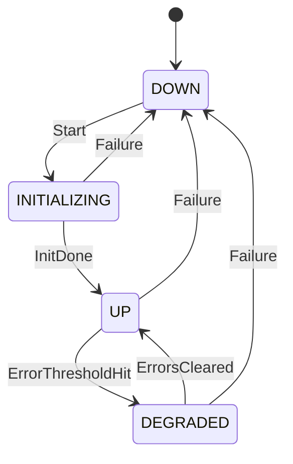

# netsim — Multi-threaded Network Packet Simulator

A small C++17 systems project simulating packet flow through a network
topology, where **each node runs on its own OS thread** and communicates
with its neighbors through a custom thread-safe bounded queue. Built to
demonstrate concurrent systems programming, OOP design, and system-design
thinking — not a real optical/networking protocol implementation.

## Architecture



Each `Node` subclass runs `run_loop()` on its own thread: block on `pop()`
from its inbound `BoundedQueue`, call the subclass's `process()`, forward
downstream if applicable. `Switch1`/`Switch2` verify packet checksums
(simulated corruption detection) and apply configurable per-hop latency.

### Link-state model



## Build & Run

Requires CMake ≥ 3.16 and a C++17 compiler.

```bash
mkdir build && cd build
cmake .. -DCMAKE_BUILD_TYPE=Debug
make -j$(nproc)

./netsim [num_packets] [queue_capacity]   # e.g. ./netsim 200 8
ctest --output-on-failure                 # run unit tests
```

### ThreadSanitizer build (concurrency validation)

```bash
mkdir build-tsan && cd build-tsan
cmake .. -DCMAKE_BUILD_TYPE=Debug -DENABLE_TSAN=ON -DBUILD_TESTS=OFF
make -j$(nproc) netsim
./netsim 200 4
```

This repo's CI runs both the standard test suite **and** a TSan build of
the simulation on every push (see `.github/workflows/ci.yml`) — thread
safety is verified continuously, not just checked once by hand.

## Design decisions

**Thread-per-node, not a shared thread pool.** Simpler mental model that
maps 1:1 to how independent network elements actually operate; the natural
next step to discuss is generalizing to a thread pool if the topology grew
to hundreds of nodes (thread-per-node stops scaling well past a few dozen
OS threads).

**Custom mutex + condition_variable bounded queue, not a lock-free ring
buffer.** Chose correctness and readability over maximum throughput for a
portfolio project; a lock-free SPSC ring buffer is the natural extension
to discuss if asked "how would you make this faster?"

**`push()` (blocking) vs `try_push()` (non-blocking) as two distinct
methods**, rather than one method with a timeout parameter — makes the
backpressure-vs-drop policy explicit at each call site instead of hidden
in a default argument.

**Checksum corruption is simulated by constructing an unsealed/tampered
`Packet` rather than mutating a sealed one** — `Packet` has no payload
mutator after construction by design, forcing corruption to be modeled
honestly as "a different packet arrived" rather than an API that could
silently desync a packet's header from its payload.

## Known simplifications (things I'd change for a "real" version)

- Single fixed topology built in `main.cpp`; a real version would load a
  topology from config and support arbitrary fan-out per node.
- Shutdown waits on a fixed `sleep_for(200ms)` for the pipeline to drain,
  rather than a proper drain-completion signal.
- No lock-free queue variant (see Design decisions above).

## Testing

27 unit tests (GoogleTest) covering: FIFO ordering, capacity enforcement,
close/drain semantics, blocking push/pop under concurrent producer and
consumer threads, multi-producer/multi-consumer stress (800 items, no
loss/duplication), exhaustive link-state FSM transition coverage
(including invalid-transition rejection), and packet checksum/framing
integrity.

## Code review process

See [`CODE_REVIEW.md`](CODE_REVIEW.md) — the checklist applied to every
change in this repo, focused on concurrency-specific failure modes.
